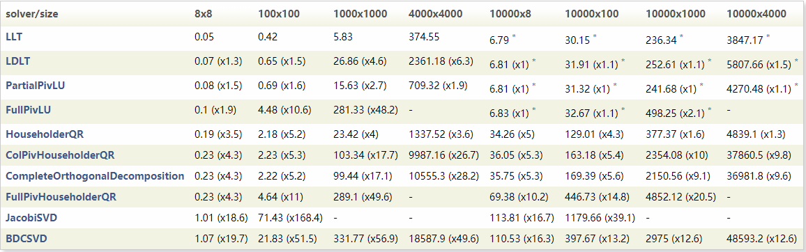

# 稠密矩阵分解测试基准

本节展示了Eigen提供的用于解决计算方阵和过约束问题的稠密矩阵分解执行速度的比较结果。
[这张表](http://eigen.tuxfamily.org/dox/group__TopicLinearAlgebraDecompositions.html)展示了更广泛的特性和排除了数据影响后计算线性方程和分解的结果。
这个测试标准是在装备有inter core i7 @ 2.6GHz的笔记本上，用**AVX**c语言编译器编译，使用**FMA**指令集，不使用多线程的条件下测试得到。变量为**单精度浮点型**变量。在使用双精度的场合，你可以将测试时间乘以2得到。

方阵是对称的，对与过约束矩阵，使用基于Cholesky和LU分解的四种求解器的时间为计算对称协方差矩阵`tran(A)*A`的耗时，其结果在右上角标记了*。时间单位为**毫秒**，倍率是相对于[LLT]分解器的结果计算的。这个分解器不仅是最快的同时也是最通用，最稳定的。

*:这个分解不支持直接求解过约束问题中的最小二乘法结果，表中的时间是计算矩阵`tran(A)*A`的对称协方差矩阵的结果。
## 观察结论
- [LLT]在所有场景中都是最快的。
- 对大型过约束问题，Cholesky/LU分解花费的时间长短主要由计算对称协方差矩阵的时间长短决定。
- 对于大尺度问题，只有采用了针对cache分块优化的分解器才表现得更优秀。这里面包括[LLT],[PartialPivLU](http://eigen.tuxfamily.org/dox/classEigen_1_1PartialPivLU.html),[HouseholderQR](http://eigen.tuxfamily.org/dox/classEigen_1_1HouseholderQR.html)和[BDCSVD](http://eigen.tuxfamily.org/dox/classEigen_1_1BDCSVD.html)四种求解器满足这个条件。这解释了为什么对于4k x 4k矩阵，[HouseHolderQR](http://eigen.tuxfamily.org/dox/classEigen_1_1HouseholderQR.html)比[LDLT]要更快。在不久的将来，[LDLT]和[ColPivHouseholderQR](http://eigen.tuxfamily.org/dox/classEigen_1_1ColPivHouseholderQR.html)也将实现分块优化策略。
- [CompleteOrthogonalDecomposition](http://eigen.tuxfamily.org/dox/classEigen_1_1CompleteOrthogonalDecomposition.html)是基于[ColPivHouseholderQR](http://eigen.tuxfamily.org/dox/classEigen_1_1ColPivHouseholderQR.html)分解器实现的，所以他们的速度表现相近。

以上表格的内容是基于[这个](https://bitbucket.org/eigen/eigen/raw/default/bench/dense_solvers.cpp)cpp文件生成的,你可以随意修改这个文件来根据你自己的机器硬件，编译器，和你关心的问题尺寸生成类似的表格。

[LLT]:http://eigen.tuxfamily.org/dox/classEigen_1_1LLT.html
[LDLT]:http://eigen.tuxfamily.org/dox/classEigen_1_1LDLT.html