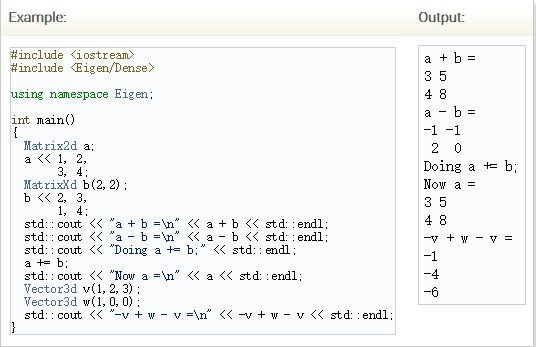
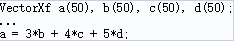
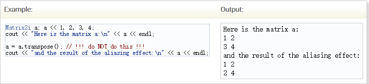
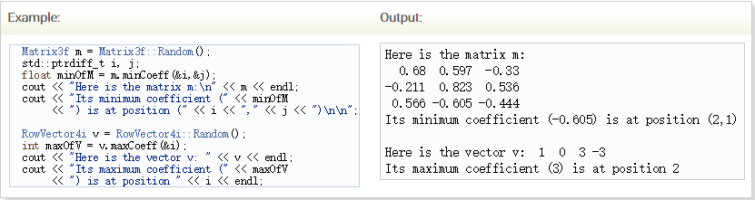

 # 矩阵和向量运算
- 稠密矩阵和数组计算
[reference](http://eigen.tuxfamily.org/dox/group__TutorialMatrixArithmetic.html)
- 主要提供综述和在矩阵、向量和标量之间怎样使用的一些细节[Eigen](http://eigen.tuxfamily.org/dox/namespaceEigen.html)。
# 介绍
[Eigen](http://eigen.tuxfamily.org/dox/namespaceEigen.html)通过重载常用的C++运算符，例如+,-,*或者通过特殊方法，例如点乘，叉乘等等。对于矩阵类（矩阵和向量）运算符重载仅仅支持线性代数运算。例如，matrix1 * matrix2为矩阵与矩阵的乘积，vector + scalar 向量与标量相加是不允许。如果想要使用各种数组运算，而不是线性代数运算，见 [下一页](http://eigen.tuxfamily.org/dox/group__TutorialArrayClass.html)
## 加法与减法
当然，左手边与右手边的行和列必须相同，也必须有同样的标量类型，Eigen不能自动类型转换。这里有运算符是：
- 二元运算符 + ，a + b
- 二元运算符 - ，a - b
- 一元运算符 - ，-a
- 复合运算符 += ， a += b
- 复合运算符 -= ， a -= b

## 标量乘法与除法
- 二元运算符 *， matrix * scalar
- 二元运算符 *， scalar * matrix
- 二元运算符 /，matrix / scalar
- 复合运算符 *=，matrix *= scalar
- 复合运算符 /=， matrix /= scalar

## 关于表达式模板的说明
这是在本章中描述的一个高级主题，但是这里只是提到它的使用，在Eigen中，运算重载符，例如Operate+不会使用任何自身的计算，仅仅返回一个表达式对象来描述使用的计算。实际计算是在之后，当整个表达式被求值时，通常在Operator=中。虽然这听起来很沉重，但是任何现代编译器都能够优化这种抽象运算符，从而得到完全优化的代码的结果。例如：

- 

- Eigen 编译器仅仅只做一次循环，以至于数组只遍历一次，简化（忽略SIMD优化器），循环如下：

- 因此，不应该担心使用带有特征的相对较大的算术表达式:这只会为Eigen提供更多的优化。
## 转置和共轭
对矩阵的转置、共轭和共轭转置分别由成员函数transpose(),conjugate(),adjoint()实现。

对于实数矩阵，共轭不会发生操作，所以adjoint()=transpose()。
对于基本的重载运算符、transpose()和adjoint()简单的返回一个代理对象，而不是做实际的转置，如果你做b = a.transpose()，然后转置在结果被写进b的同时被求值，然而这里是一个复杂的问题，如果你做 a = a.transpose()，那么在转置的计算完成之前，Eigen开始把结果写进a中，因此，并不是期待那样，公式a = a.transpose()用它替换a

这里所谓的别名问题，在调试模型，在没有断言时，将自动检测此类常见的缺陷。
对于In-place转置，对于例子a = a.transpose()，简单地使用transposeInPlace()函数

对于复杂的矩阵这里还有adjointInPlace() 函数。
## 矩阵相乘和矩阵与向量相乘
矩阵相乘使用operator* ,由于向量也是一种特殊的矩阵，这里是一种隐式处理，所以矩阵与向量乘积是一种特殊矩阵相乘，也是向量与向量的外积，因此，所有的这些运算操作同两个重载符：
- 二元重载符*，a * b
- 三元重载符 *= ，a *= b(),在右边相乘：a*=b等于a = a*b。

提示：如果你阅读上面关于表达式模板的段落和可能导致别名问题m=m*m的担忧，Eigen把矩阵相乘作为特殊情况，引用一个临时变量，因此将它编译为m=m*m
>tmp = m*m;
m = tmp;

如果知道矩阵相乘能够安全的计算成目标矩阵而没有别名问题，可以使用noalias()函数来避免临时变量。
c.noalias() += a * b;
对于更多的细节，见[aliasing](http://eigen.tuxfamily.org/dox/group__TopicAliasing.html)
提示：对于BLAS使用者担心的性能问题，表达式c.noalias() -= 2 * a.adjoint() * b全部优化和触发一个gemm-like函数调用。
## 点乘和叉乘
对于点乘与叉乘，使用dot()和cross()方法，当然点乘也可以用u.adjoint()*v表示为1x1矩阵。

记住叉乘向量的维度为3，向量的点乘任意维度，当使用复数时，Eigen点乘在第一个变量中是共轭线性的，在第二个变量中也是线性的。
## 基本算术规约操作
Eigen提供了一些对于矩阵或向量的规约操作，如sum(),prod(),maxCoeff()和minCoeff()

矩阵的迹，由函数trace()返回，迹是矩阵对角系数之和，也可以使用a.diagonal().sum()高效计算。
这里还存在minCoeff 和maxCoeff 函数返回各系数的坐标

## 操作的有效性
Eigen检查执行的操作的有效性。如果可能，它会在编译时检查它们，从而产生编译错误。这些错误消息可能又长有难看，但是Eigen用大写字母 UPPERCASE_LETTERS_SO_IT_STANDS_OUT写重要的消息。例如:
>>Matrix3f m;
Vector4f v;
v = m*v;      // Compile-time error: YOU_MIXED_MATRICES_OF_DIFFERENT_SIZES
当然，在许多情况下，例如在检查动态大小时，无法在编译时执行检查。然后使用运行时断言。这意味着如果在“调试模式”下运行，程序在执行非法操作时将使用错误消息中止，如果关闭断言，程序可能会崩溃。
>MatrixXf m(3,3);
VectorXf v(4);
v = m * v; // Run-time assertion failure here: "invalid matrix product"

更多细节，见[下一页](http://eigen.tuxfamily.org/dox/TopicAssertions.html)
